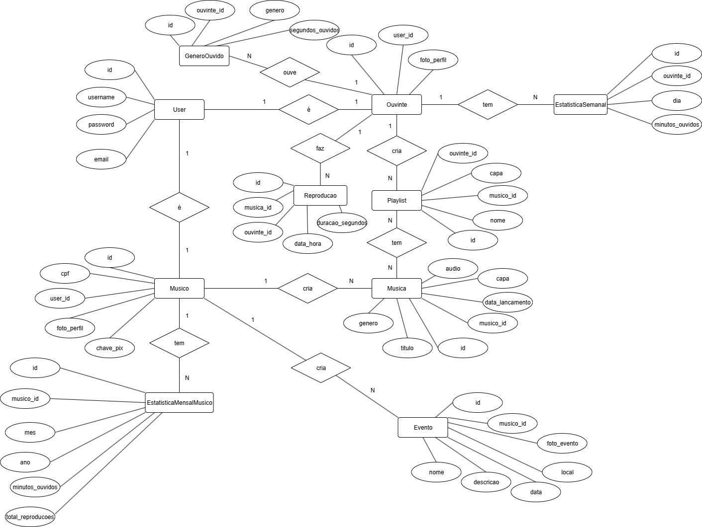
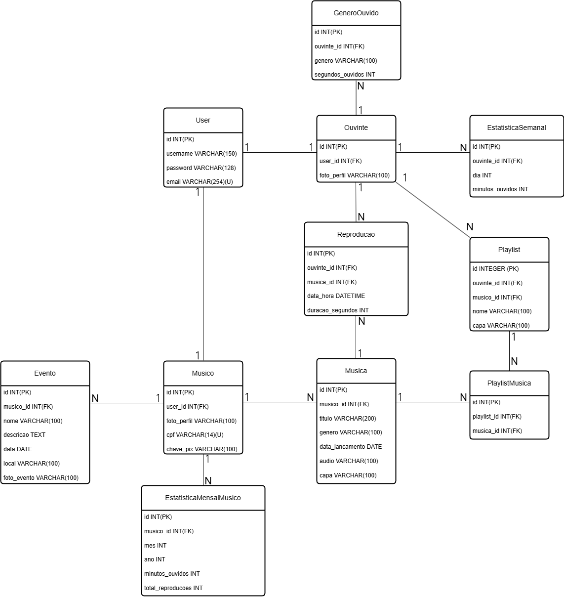

# Modelo de Dados

## Diagrama ER

## Modelo Relacional

## Dicionário de Dados

--- 
**Tabela** : Ouvinte

*Descrição* : Usuário que pode reproduzir músicas e criar playlists

*Observações* : ...

| Colunas | Descrição | Tipo de Dado | Tamanho | Null | PK | FK | Unique | Identity | Default | Check | 
| ------- | --------- | ------------ | ------- | ---- | -- | -- | ------ | -------- | ------- | ----- |
| id | ID do ouvinte | INT | - | &#9744;  | &#9745; | &#9744; | &#9744; | &#9745; | - | - | 
| user_id | ID do user associado a ouvinte | INT | - | &#9744;  | &#9744; | &#9744; | &#9744; | &#9744; | - | - | 
| foto_perfil | Foto de perfil do ouvinte | VARCHAR | 255 | &#9745;  | &#9744; | &#9744; | &#9744; | &#9744; | - | - | 

--- 
**Tabela** : Musico

*Descrição* : Usuário que além de ter as funções do ouvinte pode postar músicas e eventos

*Observações* : 

| Colunas | Descrição | Tipo de Dado | Tamanho | Null | PK | FK | Unique | Identity | Default | Check | 
| ------- | --------- | ------------ | ------- | ---- | -- | -- | ------ | -------- | ------- | ----- |
| id | ID do músico | INT | - | &#9744;  | &#9745; | &#9744; | &#9744; | &#9745; | - | - |
| user_id | ID do user associado a músico | VARCHAR | 255 | &#9744; | &#9744; | &#9745; | &#9744; | &#9744; | - | - |
| foto_perfil | Foto de perfil do músico | VARCHAR | 255 | &#9744;  | &#9744; | &#9744; | &#9744; | &#9744; | - | - |
| cpf | CPF do músico | VARCHAR | 14 | &#9744; | &#9744; | &#9744; | &#9745; | &#9744; | - | - |
| chave_pix | Chave pix do músico | VARCHAR | 77 | &#9744;  | &#9744; | &#9744; | &#9744; | &#9744; | - | - |

--- 
**Tabela** : User

*Descrição* : Usuário que pode ser um ouvinte ou músico

*Observações* : ...
| Colunas | Descrição | Tipo de Dado | Tamanho | Null | PK | FK | Unique | Identity | Default | Check |
| ------- | --------- | ------------ | ------- | ---- | -- | -- | ------ | -------- | ------- | ----- |
| id | ID do usuário | INT | - | &#9744;  | &#9745; | &#9744; | &#9744; | &#9745; | - | - |
| nome | Nome do usuário(Ouvinte ou Músico) | VARCHAR | 60 | &#9744;  | &#9744; | &#9744; | &#9744; | &#9744; | &#9744; | - | - |
| email | Email do usuário(Ouvinte ou Músico) | VARCHAR | 150 | &#9744;  | &#9744; | &#9744; | &#9745; | &#9744; | - | - |
| password | Senha do usuário(Ouvinte ou Músico) | VARCHAR | 255 | &#9744; | &#9744; | - | &#9744; | &#9744; | &#9744; | - | - |   

---
**Tabela** : Musica

*Descrição* : Músicas criadas pelos músicos

*Observações* : ...

| Colunas | Descrição | Tipo de Dado | Tamanho | Null | PK | FK | Unique | Identity | Default | Check | 
| ------- | --------- | ------------ | ------- | ---- | -- | -- | ------ | -------- | ------- | ----- |
| id | ID da música | INT | - | &#9744; | &#9745; | &#9744; | &#9744; | &#9745; | - | - |
| musico_id | ID do músico que publicou a música | INT | - | &#9744; | &#9744; | &#9745; | &#9744; | &#9744; | - | - |
| titulo | Título da música | VARCHAR | 200 | &#9744; | &#9745; | &#9744; | &#9744; | &#9744; | - | - | 
| genero | Gênero da música | VARCHAR | 100 | &#9744; | &#9744; | &#9744; | &#9744; | &#9744; | - | - | 
| data_lancamento | Data de publicação da música | VARCHAR | 255 | &#9744; | &#9744; | &#9744; | &#9744; | &#9744; | - | - | 
| audio | Arquivo de áudio da música | VARCHAR | 100 | &#9744; | &#9744; | &#9744; | &#9744; | &#9744; | - | - |
| capa | Capa da música | VARCHAR | 100 | &#9745; | &#9744; | &#9744; | &#9744; | &#9744; | - | - |

--- 
**Tabela** : Evento

*Descrição* : Evento musical criado por músicos para divulgar suas apresentações

*Observações* : chave primária composta

| Colunas | Descrição | Tipo de Dado | Tamanho | Null | PK | FK | Unique | Identity | Default | Check | 
| ------- | --------- | ------------ | ------- | ---- | -- | -- | ------ | -------- | ------- | ----- |
| id | ID do evento | INT | - | &#9744; | &#9745; | &#9744; | &#9744; | &#9745; | - | - |
| musico_id | ID do músico que criou o evento | INT | - | &#9744; | &#9745; | &#9744; | &#9744; | &#9744; | - | - |
| nome | Nome do evento | VARCHAR | 60 | &#9744;  | &#9744; | &#9744; | &#9744; | &#9744; | - | - | 
| descricao | Descrição do evento | TEXT | - | &#9744;  | &#9744; | &#9744; | &#9744; | &#9744; | - | - | 
| data | Data do evento | DATE | - | &#9744;  | &#9745; | &#9744; | &#9744; | &#9744; | - | - | 
| local | Local de realização do evento | VARCHAR | 100 | &#9744;  | &#9744; | &#9744; | &#9744; | &#9744; | - | - | 
| foto_evento | Foto do evento | VARCHAR | 100 | &#9745;  | &#9744; | &#9744; | &#9744; | &#9744; | - | - |
--- 
**Tabela** : Playlist

*Descrição* : Playlist com as músicas adicionas pelos ouvintes ou músicos

*Observações* : ...

| Colunas | Descrição | Tipo de Dado | Tamanho | Null | PK | FK | Unique | Identity | Default | Check | 
| ------- | --------- | ------------ | ------- | ---- | -- | -- | ------ | -------- | ------- | ----- |
| id | ID da playlist | INT | - | &#9744;  | &#9745; | &#9744; | &#9744; | &#9745; | - | - |
| nome | Nome da playlist | VARCHAR | 60 | &#9744;  | &#9745; | &#9744; | &#9744; | &#9744; | - | - | 
| ouvinte_id | ID para Ouvinte | INT | - | &#9744; | &#9745; | &#9745; | &#9744; | &#9744; | - | - | 
| musico_id | ID para Musico | INT | - | &#9744; | &#9745; | &#9745; | &#9744; | &#9744; | - | - |
| capa | Foto da capa da playlist | VARCHAR | 100 | &#9745;  | &#9744; | &#9744; | &#9744; | &#9744; | - | - | 

--- 
**Tabela** : PlaylistMusica

*Descrição* : Associação entre músicas e playlists, representando quais músicas fazem parte de quais playlists

*Observações* : Tabela de relacionamento muitos-para-muitos entre Musica e Playlist; A chave primária é composta

| Colunas | Descrição | Tipo de Dado | Tamanho | Null | PK | FK | Unique | Identity | Default | Check |
| ------- | --------- | ------------ | ------- | ---- | -- | -- | ------ | -------- | ------- | ----- |
| id | ID da associação | INT | - | &#9744; | &#9745; | &#9744; | &#9744; | &#9745; | - | - |
| playlist_id | ID da playlist associada | INT | - | &#9744; | &#9745; | &#9745; | &#9744; | &#9744; | - | - |
| musica_id | ID da música associada | INT | - | &#9744; | &#9745; | &#9745; | &#9744; | &#9744; | - | - |

--- 
**Tabela** : EstatisticaSemanal

*Descrição* : Estatísticas semanais do Ouvinte

*Observações* : ...

| Colunas | Descrição | Tipo de Dado | Tamanho | Null | PK | FK | Unique | Identity | Default | Check |
| ------- | --------- | ------------ | ------- | ---- | -- | -- | ------ | -------- | ------- | ----- |
| id | ID da estatística semanal | INT | - | &#9744; | &#9745; | &#9744; | &#9744; | &#9745; | - | - |
| ouvinte_id | ID do ouvinte associado à estatística | VARCHAR | 150 | &#9744; | &#9744; | &#9745; | &#9744; | &#9744; | - | - |
| dia | Dia da semana (1 a 7) | INT | - | &#9744; | &#9744; | &#9744; | &#9744; | &#9744; | - | - |
| minutos_ouvidos | Minutos ouvidos no dia | INT | - | &#9744; | &#9744; | &#9744; | &#9744; | &#9744; | - | - |

---
**Tabela** : GeneroOuvido

*Descrição* : Gêneros ouvidos pelo Ouvinte

*Observações* : ...

| Colunas | Descrição | Tipo de Dado | Tamanho | Null | PK | FK | Unique | Identity | Default | Check |
| ------- | --------- | ------------ | ------- | ---- | -- | -- | ------ | -------- | ------- | ----- |
| id | ID do gênero ouvido | INT | - | &#9744; | &#9745; | &#9744; | &#9744; | &#9745; | - | - |
| ouvinte_id | ID do ouvinte associado ao gênero | INT | - | &#9744; | &#9744; | &#9745; | &#9744; | &#9744; | - | - |
| genero | Gênero musical | VARCHAR | 100 | &#9744; | &#9744; | &#9744; | &#9744; | &#9744; | - | - |
| segundos_ouvidos | Segundos ouvidos do gênero | INT | - | &#9744; | &#9744; | &#9744; | &#9744; | &#9744; | - | - |       

---
**Tabela** : EstatisticaMensalMusico

*Descrição* : Estatísticas mensais do Músico

*Observações* : ...

| Colunas | Descrição | Tipo de Dado | Tamanho | Null | PK | FK | Unique | Identity | Default | Check |
| ------- | --------- | ------------ | ------- | ---- | -- | -- | ------ | -------- | ------- | ----- |
| id | ID da estatística mensal | INT | - | &#9744; | &#9745; | &#9744; | &#9744; | &#9745; | - | - |
| musico_id | ID do músico associado à estatística | INT | - | &#9744; | &#9745; | &#9744; | &#9744; | &#9744; | - | - |
| mes | Mês da estatística | INT | - | &#9744; | &#9744; | &#9744; | &#9744; | &#9744; | - | - |
| ano | | Ano da estatística | INT | - | &#9744; | &#9744; | &#9744; | &#9744; | &#9744; | - | - |
| minutos_ouvidos | Minutos ouvidos no mês | INT | - | &#9744; | &#9744; | &#9744; | &#9744; | &#9744; | - | - |
| total_reproducoes | Total de reproduções no mês | INT | - | &#9744; | &#9744; | &#9744; | &#9744; | &#9744; | - | - |

---
**Tabela** : Reproducao

*Descrição* : Reproduções de músicas pelos ouvintes

*Observações* : ...

| Colunas | Descrição | Tipo de Dado | Tamanho | Null | PK | FK | Unique | Identity | Default | Check |
| ------- | --------- | ------------ | ------- | ---- | -- | -- | ------ | -------- | ------- | ----- |
| id | ID da reprodução | INT | - | &#9744; | &#9745; | &#9744; | &#9744; | &#9745; | - | - |
| ouvinte_id | ID do ouvinte que reproduziu a música | INT | - | &#9744; | &#9744; | &#9745; | &#9744; | &#9744; | - | - |
| musica_id | ID da música reproduzida | INT | - | &#9744; | &#9744; | &#9745; | &#9744; | &#9744; | - |
| data_hora | Data e hora da reprodução | DATETIME | - | &#9744; | &#9744; | &#9744; | &#9744; | &#9744; | - | - |
| duracao_segundos | Duração em segundos da reprodução | INT | - | &#9744; | &#9744; | &#9744; | &#9744; | &#9744; | - | - |

---
