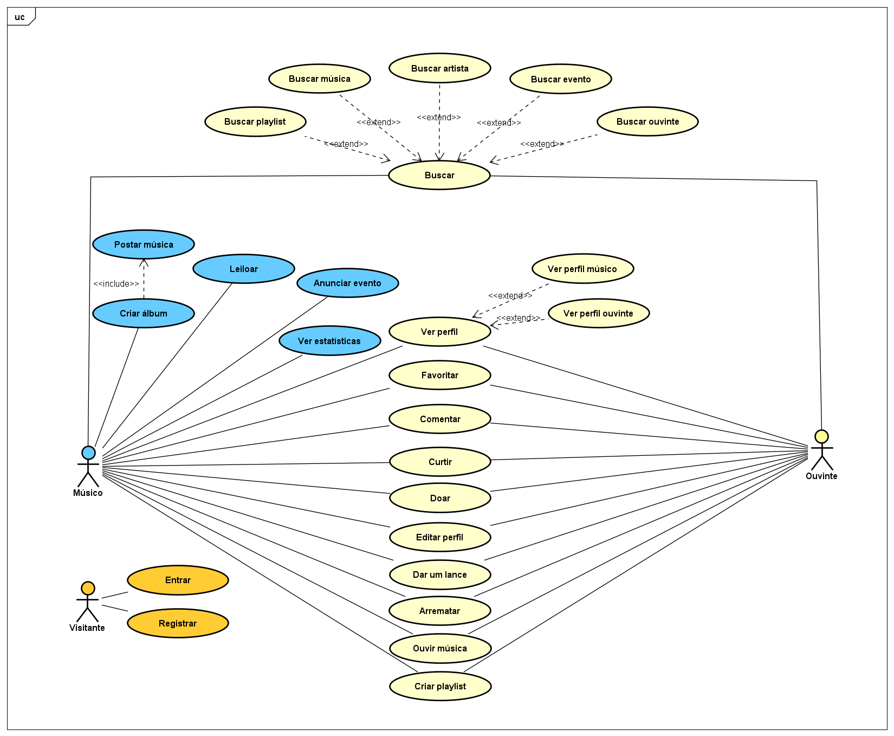
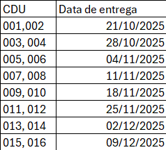

# Modelo de Casos de Uso

## 1. Diagrama de Casos de Uso

## 2. Listagem dos detalhamentos dos casos de uso(em ordem de prioridade)

<!-- MODELO BASE 1. [CDU-001 - Nome...](cdu-001/detalhamento-001.md) -->
1.  [ CDU-001 - Ouvir música     ](cdu-001/readme.md)
2.  [ CDU-002 - Criar álbum      ](cdu-002/readme.md)
3.  [ CDU-003 - Ver estatísticas ](cdu-003/readme.md)
4.  [ CDU-004 - Criar playlist   ](cdu-004/readme.md)
5.  [ CDU-005 - Doar             ](cdu-005/readme.md)
6.  [ CDU-006 - Buscar           ](cdu-006/readme.md)
7.  [ CDU-007 - Anunciar evento  ](cdu-007/readme.md)
8.  [ CDU-008 - Ver perfil       ](cdu-008/readme.md)
9.  [ CDU-009 - Editar perfil    ](cdu-009/readme.md)
10. [ CDU-010 - Leiloar          ](cdu-010/readme.md)
11. [ CDU-011 - Dar um lance     ](cdu-011/readme.md)
12. [ CDU-012 - Arrematar        ](cdu-012/readme.md)
13. [ CDU-013 - Comentar         ](cdu-013/readme.md)
14. [ CDU-014 - Curtir           ](cdu-014/readme.md)
15. [ CDU-015 - Entrar           ](cdu-015/readme.md)
16. [ CDU-016 - Registrar        ](cdu-016/readme.md)

## 3. Planejamento de entregas parciais

