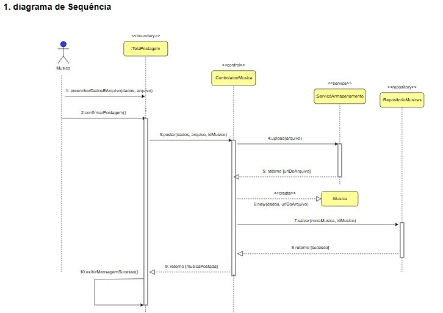
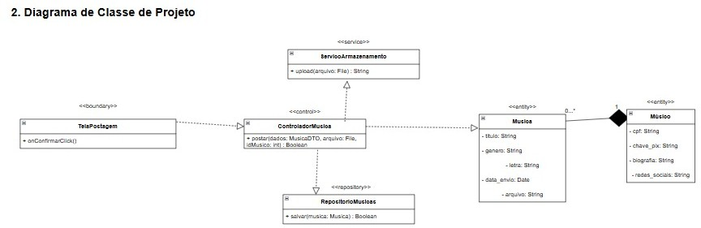

# CDU006. Publicar Música

- **Ator principal**: Músico.
- **Atores secundários**:
- **Resumo**: Permite que o músico envie uma música para a plataforma, informando detalhes como título, gênero, capa e o arquivo de áudio.
- **Pré-condição**: O usuário deve estar autenticado no sistema.
- **Pós-condição**: A música é adicionada ao catálogo do sistema e associada ao perfil do músico.

## Fluxo Principal – Música postada com sucesso
| Ações do ator | Ações do sistema |
| :-----------------: | :-----------------: | 
| 1 - Acessa a área “Publicar Música”	                 | |
|                                                        | 2 - Exibe o formulário |
| 3 - Preenche os dados da música (título, gênero, etc.) | |
|                                                        | 4 - Valida os dados preenchidos |
| 5 - Clica no botão "Publicar"                          | | 
|                                                        | 6 - Armazena a música e exibe mensagem de sucesso |

## Fluxo Alternativo I – Campos obrigatórios não preenchidos
| Ações do ator | Ações do sistema |
| :-----------------: | :-----------------: | 
| 3.1 - Deixa algum campo obrigatório em branco	| | 
|                                               | 3.2 - Exibe mensagem: “Preencha todos os campos obrigatórios” |

## Fluxo Alternativo II – Arquivo de áudio ou imagem de capa inválidos
| Ações do ator | Ações do sistema |
| :-----------------: | :-----------------: | 
| 5.1 - Tenta enviar um arquivo inválido (formato ou tamanho não permitido)	| |
|                                                                           | 5.2 - Exibe mensagem: “Tipo de arquivo inválido ou tamanho excedido” |

> Obs. as seções a seguir apenas serão utilizadas na segunda unidade do PDSWeb (segundo orientações do gerente do projeto).

## Diagrama de Interação (Sequência ou Comunicação)

<!-- > Substituir pela imagem correspondente... -->

## Diagrama de Classes de Projeto

<!-- > Substituir pela imagem contendo as classes (modelo, visão e templates) que implementam o respectivo CDU... -->
