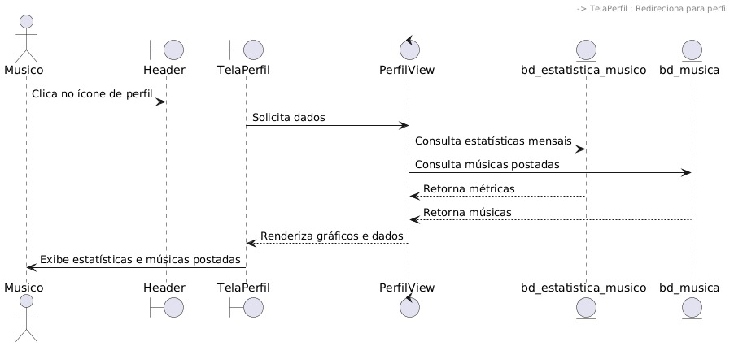
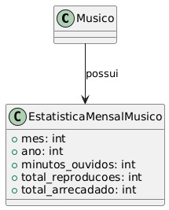

# CDU008: Ver Estatísticas

- **Ator principal**: Ouvinte ou músico
- **Atores secundários**:
- **Resumo**: Permite que o músico ou ouvinte visualize estatísticas exclusivas de cada tipo de usuário.
- **Pré-condição**: O usuário deve estar autenticado no sistema.
- **Pós-condição**: As estatísticas são exibidas na página de perfil própria, mas nenhuma haverá alteração nos dados do sistema.

## Fluxo Principal – Estatísticas exibidas com sucesso
| Ações do ator | Ações do sistema |
| :-----------------: | :-----------------: | 
| 1 - Acessa a página de perfil própria | | 
|                                       | 2 - Exibe os gráficos, tabelas ou dados solicitados |

## Fluxo Alternativo I – Falha na recuperação de dados
| Ações do ator | Ações do sistema |
| :-----------------: | :-----------------: | 
| 1.1 - Acessa a página de perfil própria | | 
|                                         | 1.2 - Exibe mensagem: “Não foi possível carregar os dados. Tente novamente mais tarde.” |

> Obs. as seções a seguir apenas serão utilizadas na segunda unidade do PDSWeb (segundo orientações do gerente do projeto).

## Diagrama de Interação (Sequência ou Comunicação)

<!-- > Substituir pela imagem correspondente... -->

## Diagrama de Classes de Projeto

<!-- > Substituir pela imagem contendo as classes (modelo, visão e templates) que implementam o respectivo CDU... -->
