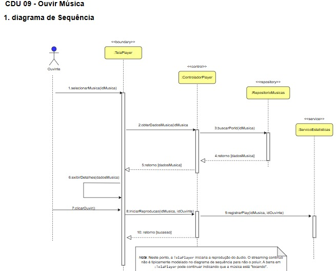
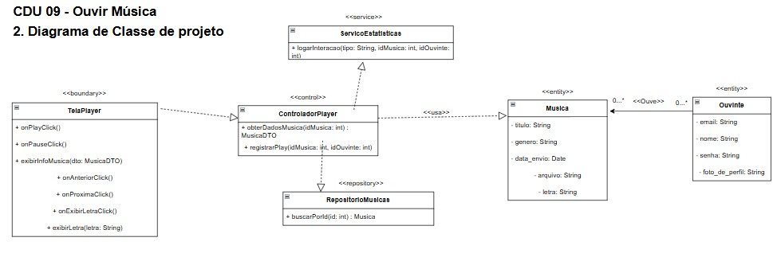

# CDU009. Nome: Ouvir Música

- **Ator principal**: Ouvinte ou músico.
- **Atores secundários**: 
- **Resumo**: Permite que o ouvinte ou músico reproduza uma música disponível na plataforma.
- **Pré-condição**: O sistema deve conter músicas disponíveis para serem ouvidas e o usuário deve estar logado.
- **Pós-condição**: A música é reproduzida e o sistema registra a interação (play) para fins estatísticos.

## Fluxo Principal – Reprodução com sucesso
| Ações do ator | Ações do sistema |
| :-----------------: | :-----------------: | 
| 1 - Acessa uma música disponível	            | | 
| 2 - Clica no botão de play                            | | 
|                                                       | 3 - Inicia a reprodução e registra o play |
| 4 - Usa os controles (pausar, avançar, voltar, parar)	| | 
|                                                       | 5 - Executa a ação solicitada no player |

## Fluxo Alternativo I – Música indisponível
| Ações do ator | Ações do sistema |
| :-----------------: | :-----------------: | 
| 1.1 - Seleciona uma música removida ou com erro	| |
|                                                 |1.2 - Exibe mensagem: “Música indisponível no momento” |

## Fluxo Alternativo II – Conexão instável ou falha na reprodução
| Ações do ator | Ações do sistema |
| :-----------------: | :-----------------: | 
| 3.1 - Clica no botão de play e há falha de conexão	| | 
|                                             | 3.2 - Exibe mensagem: “Erro na reprodução. Verifique sua conexão e tente novamente” |

> Obs. as seções a seguir apenas serão utilizadas na segunda unidade do PDSWeb (segundo orientações do gerente do projeto).

## Diagrama de Interação (Sequência ou Comunicação)

<!-- > Substituir pela imagem correspondente... -->

## Diagrama de Classes de Projeto

<!-- > Substituir pela imagem contendo as classes (modelo, visão e templates) que implementam o respectivo CDU... -->
