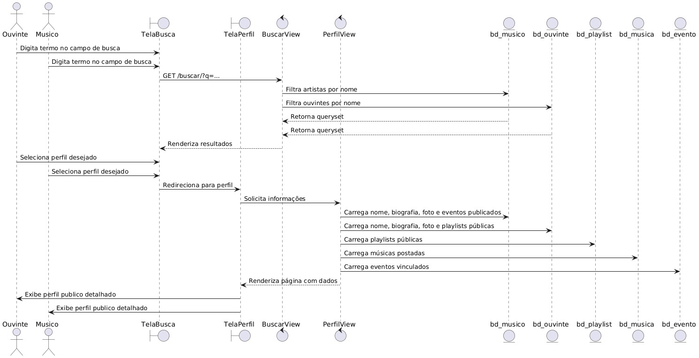
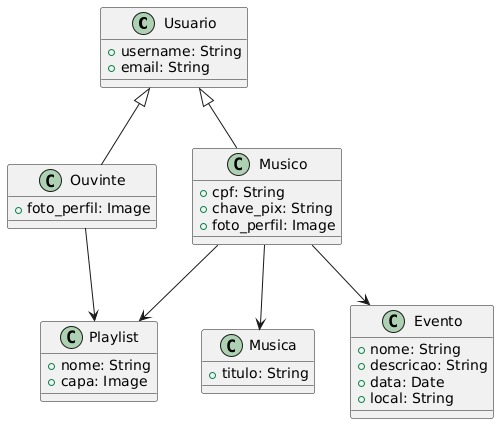

# CDU010. Nome: Ver Perfil

- **Ator principal**: Ouvinte e músico
- **Atores secundários**:
- **Resumo**: Permite que qualquer usuário da plataforma visualize o perfil público de um músico ou ouvinte contendo informações como nome, playlists, músicas postadas, eventos e estatísticas públicas.
- **Pré-condição**: O sistema deve estar acessível e o perfil consultado deve estar visível.
- **Pós-condição**: As informações públicas do perfil são exibidas para o usuário.

## Fluxo Principal – Perfil visualizado com sucesso
| Ações do ator | Ações do sistema |
| :-----------------: | :-----------------: | 
| 1 - Busca ou clica no nome de um usuário (músico ou ouvinte)	| | 
|                                                               | 2 - Recupera as informações públicas do perfil solicitado |
| 3 - Acessa a página de perfil	                                | | 
|                                                               | 4 - Exibe dados como nome, músicas, playlists e eventos|

## Fluxo Alternativo I - Buscar perfil inexistente 
| Ações do ator | Ações do sistema |
| :-----------------: | :-----------------: | 
| 1.1 - Busca por um perfil inexistente | | 
|                                       | 1.2 - Exibe mensagem: “Perfil não encontrado” |

> Obs. as seções a seguir apenas serão utilizadas na segunda unidade do PDSWeb (segundo orientações do gerente do projeto).

## Diagrama de Interação (Sequência ou Comunicação)

<!-- > Substituir pela imagem correspondente... -->

## Diagrama de Classes de Projeto

<!-- > Substituir pela imagem contendo as classes (modelo, visão e templates) que implementam o respectivo CDU... -->
