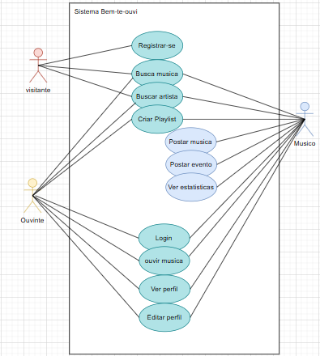

# Modelo de Casos de Uso

## 1. Diagrama de Casos de Uso

## 2. Listagem dos detalhamentos dos casos de uso

<!-- MODELO BASE 1. [CDU-001 - Nome...](cdu-001/detalhamento-001.md) -->
1.  [CDU-001 - Registrar        ](cdu-001/detalhamento-001.md)
2.  [CDU-002 - Login            ](cdu-002/detalhamento-002.md)
3.  [CDU-003 - Buscar musica    ](cdu-003/detalhamento-003.md)
4.  [CDU-004 - Buscar artista   ](cdu-004/detalhamento-004.md)
5.  [CDU-005 - Criar playlist   ](cdu-005/detalhamento-005.md)
6.  [CDU-006 - Postar música    ](cdu-006/detalhamento-006.md)
7.  [CDU-007 - Postar evento    ](cdu-007/detalhamento-007.md)
8.  [CDU-008 - Ver estatísticas ](cdu-008/detalhamento-008.md)
9.  [CDU-009 - Ouvir música     ](cdu-009/detalhamento-009.md)
10. [CDU-010 - Ver perfil       ](cdu-010/detalhamento-010.md)
11. [CDU-011 - Edital           ](cdu-011/detalhamento-011.md)
