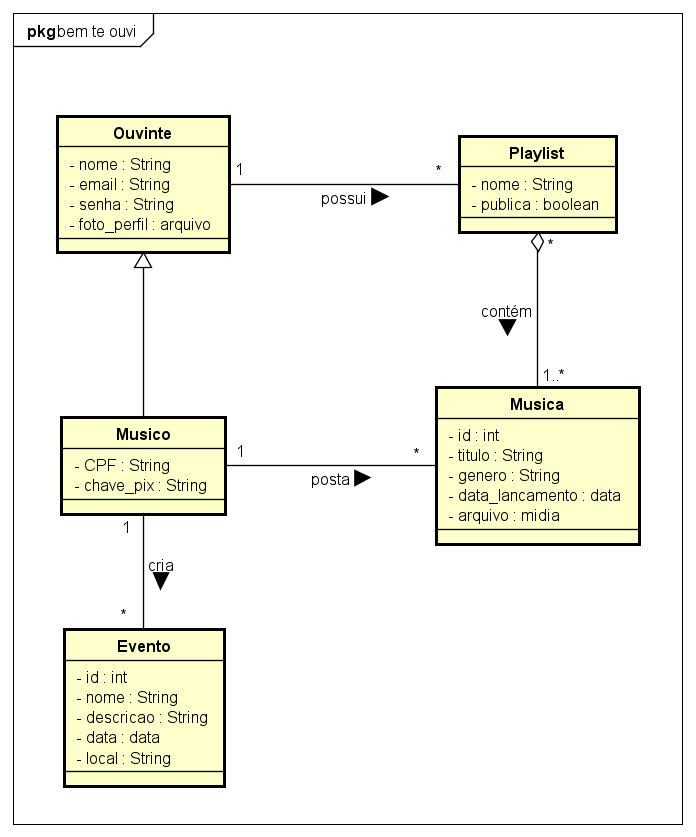

# Modelo de Domínio

Associações:

Ouvinte -> Playlist:
 
`1:*` (um ouvinte pode possuir várias playlists)

Playlist -> Música: associação de agregação
 
`*:1..*` (uma playlist pode conter várias músicas e uma música pode estar contida em várias playlists)

Músico -> Música:
 
`1:*` (um músico pode postar várias músicas)

Músico -> Evento:
 
`1:*` (um músico pode criar vários eventos)

## Glossário (sugestão)

|  Termo    |                          Explicação                             |
| --------- | --------------------------------------------------------------- |
| Visitante | Usuário não cadastrado                                          |
| Ouvinte   | Quem irá escutar as músicas e visitar o perfil do artista       |
| Músico    | Artista independente que buscar divulgar suas músicas e eventos |
