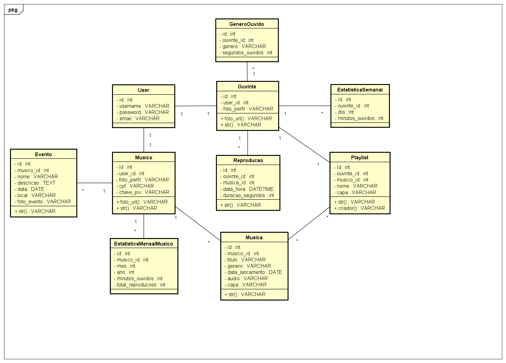

# Diagrama de Classes de Projeto

## Glossário (sugestão)

|  Termo  |  Explicação  |
| ------- | ------------ |
| User | Usuário base do Django, utilizado para autenticação (login, senha, e-mail). Serve como base para os perfis de Ouvinte e Músico.|
| Ouvinte | Representa um usuário que consome músicas. Está associado a um User e pode criar playlists, ouvir músicas e gerar estatísticas.|
| Musico | Representa um usuário que publica músicas e participa de eventos. Está associado a um User e possui dados extras como CPF e chave PIX. |
| Musica | Objeto que representa uma música publicada por um músico, contendo título, gênero, data de lançamento, arquivo de áudio e imagem de capa. |
| Playlist | 	Lista de músicas criada por um ouvinte ou músico. Pode conter várias músicas e uma imagem de capa. |
| Evento | 	Representa um show, live ou apresentação vinculada a um músico, com informações de nome, descrição, local e data. |
| Reproducao | 	Registro de uma execução de música por um ouvinte, com data, duração e música associada. Serve como base para as estatísticas. |
| EstatisticaSemanal | Armazena quantos minutos um ouvinte escutou em cada dia da semana (de 0 = Domingo a 6 = Sábado). |
| Genero Ouvido | Quantifica quantos segundos o ouvinte escutou de determinado gênero musical. |
| EstatisticaMensalMusico | 	Armazena dados mensais do desempenho do músico: total de minutos ouvidos e quantidade de reproduções. |
