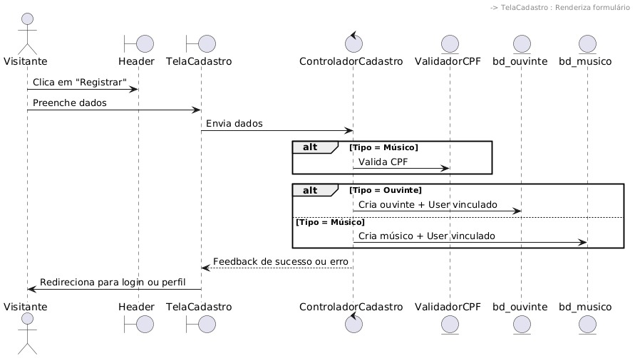
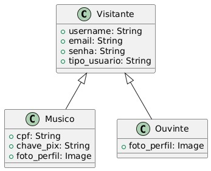

# CDU001. Registrar-se

- **Ator principal**: Visitante.
- **Atores secundários**:
- **Resumo**: O visitante, na primeira vez que vai utilizar mais funcionalidades do sistema, precisa se registrar.
- **Pré-condição**: O visitante não possui uma conta registrada no sistema.
- **Pós-Condição**: visitante agora é considerado um usuário registrado: ouvinte ou músico.

## Fluxo Principal
| Ações do ator | Ações do sistema |
| :-----------------: | :-----------------: | 
| 1 - O visitane acessa a tela de registro do sistema       | |  
|                                                           | 2 - O sistema exibe o formulário de registro (com campos como nome, e-mail, senha, etc.). | 
| 3 -  O visitante preenche todos os campos obrigatórios.   | | 
| 4 -  Visitante envia o formulário (clica em “Registrar”). | | 
|                                                           | 5 - O sistema valida os dados informados.| 
|                                                           | 6 - O sistema cria uma nova conta com os dados informados. |
|                                                           | 7 - O sistema confirma o registro e informa o sucesso ao usuário. |
|                                                           | 8 - O visitante é redirecionado para a tela inicial já autenticado.|

## Fluxo Alternativo I - Dados obrigatórios não preenchidos
| Ações do ator | Ações do sistema |
| :-----------------: |:-----------------: | 
| 4.1 - O visitante deixa campos obrigatórios em branco   | |  
|                                                         | 4.2 - O sistema exibe uma mensagem de erro indicando os campos obrigatórios que devem ser preenchidos |
| 4.3 - O visitante  corrige e reenvia o formulário       | |  

## Fluxo Alternativo II -  E-mail já cadastrado
| Ações do ator | Ações do sistema |
| :-----------------: | :-----------------: | 
|                                                                           | 4.1 - O sistema informa que o e-mail já está registrado. |  
| 4.2 -  O visitante pode optar por redefinir a senha ou usar outro e-mail. | |

> Obs. as seções a seguir apenas serão utilizadas na segunda unidade do PDSWeb (segundo orientações do gerente do projeto).

## Diagrama de Interação (Sequência ou Comunicação)

<!-- > Substituir pela imagem correspondente... -->

## Diagrama de Classes de Projeto

<!-- > Substituir pela imagem contendo as classes (modelo, visão e templates) que implementam o respectivo CDU... -->

