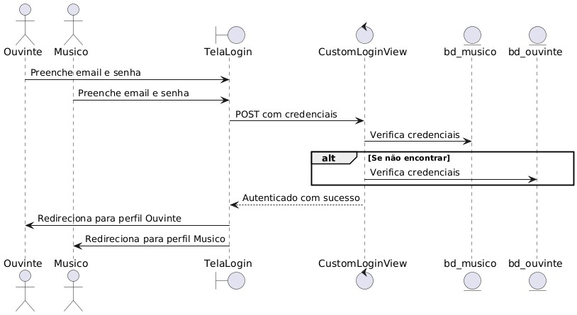
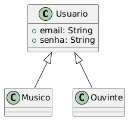

# CDU002. Logar

- **Ator principal**: Visitante
- **Atores secundários**:
- **Resumo**: O visitante vai usar os dados já cadastrados para logar na sua conta.
- **Pré-condição**: O visitante não está logado no sistema.
- **Pós-condição**: O usuário é autenticado e tem acesso à sua conta e suas configurações.

## Fluxo Principal – Login com sucesso
| Ações do ator                      | Ações do sistema |
| :-----------------:                | :-----------------: | 
| 1 - Acessa a página de login	     |  |    
|                                    | 2 - Exibe o formulário de login |
| 3 - Informa e-mail e senha         |  | 
|                                    | 4 - Valida as credenciais informadas | 
| 5 - Clica no botão "Entrar"	       |  | 
|                                    |6 - Autentica o usuário e redireciona para a tela inicial já autenticado | 

## Fluxo Alternativo I – Credenciais inválidas
| Ações do ator | Ações do sistema |
| :-----------------: |:-----------------: | 
| 3.1 - Informa e-mail ou senha incorretos	| | 
|                                           | 3.2 - Exibe mensagem de erro: “E-mail ou senha inválidos” |

## Fluxo Alternativo II – Campos em branco
| Ações do ator                                           | Ações do sistema |
| :-----------------:                                     |:-----------------: | 
| 5.1 - Tenta enviar o formulário sem preencher os campos	| | 
|                                                         | 5.2 - Exibe mensagem: “Preencha todos os campos obrigatórios” |

> Obs. as seções a seguir apenas serão utilizadas na segunda unidade do PDSWeb (segundo orientações do gerente do projeto).

## Diagrama de Interação (Sequência ou Comunicação)

<!-- > Substituir pela imagem correspondente... -->

## Diagrama de Classes de Projeto

<!-- > Substituir pela imagem contendo as classes (modelo, visão e templates) que implementam o respectivo CDU... -->

