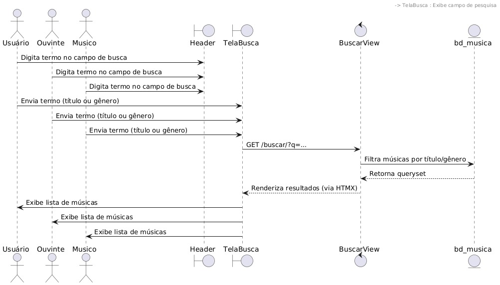
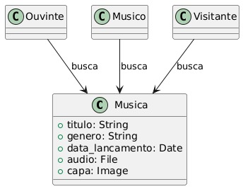

# CDU003. Buscar música

- **Ator principal**: Visitante ou ouvinte ou músico.
- **Atores secundários**:
- **Resumo**: Permite que qualquer usuário (visitante, ouvinte ou músico) busque músicas disponíveis no sistema através de filtros como nome da música, artista, gênero, ou palavra-chave.
- **Pré-condição**: O sistema deve conter músicas cadastradas.
- **Pós-condição**: As músicas que correspondem aos critérios de busca são exibidas para o usuário.

## Fluxo Principal – Busca realizada com sucesso
| Ações do ator | Ações do sistema |
| :-----------------: | :-----------------: | 
| 1 - Acessa a interface de busca                          | |     
| 2 - Digita o termo da busca	                           | | 
|                                                          | 3 - Processa o termo e realiza a busca no banco de dados |
| 4 - Confirma a busca ao clicar no botão de buscar        | |
|                                                          | 5 - Exibe os resultados da busca |

## Fluxo Alternativo I – Nenhuma música encontrada
| Ações do ator | Ações do sistema |
| :-----------------: | :-----------------: | 
| 2.1 - Digita um termo que não retorna resultados	| |
|                                                   | 2.2 - Exibe mensagem: “Nenhuma música encontrada para sua busca” |

## Fluxo Alternativo II – Campo de busca vazio
| Ações do ator | Ações do sistema |
| :-----------------: | :-----------------: | 
| 4.1 - Tenta buscar sem preencher o campo de busca | |	
|                                                   | 4.2 - Exibe mensagem: “Digite um nome ou critério para buscar” |

> Obs. as seções a seguir apenas serão utilizadas na segunda unidade do PDSWeb (segundo orientações do gerente do projeto).

## Diagrama de Interação (Sequência ou Comunicação)

<!-- > Substituir pela imagem correspondente... -->

## Diagrama de Classes de Projeto

<!-- > Substituir pela imagem contendo as classes (modelo, visão e templates) que implementam o respectivo CDU... -->

