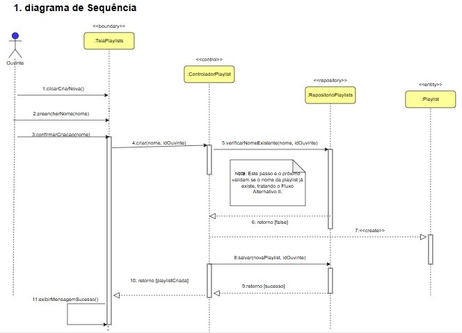
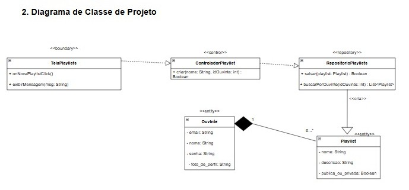

# CDU005 Nome: Criar Playlist

- **Ator principal**: Ouvinte e músico.
- **Atores secundários**: 
- **Resumo**: Permite que um ouvinte ou músico crie uma nova playlist personalizada e defina um nome, uma capa(opcional) e adicione músicas.
- **Pré-condição**: O usuário deve estar autenticado no sistema.
- **Pós-condição**: Uma nova playlist é criada e associada à conta do usuário.

## Fluxo Principal – Criação de playlist com sucesso
| Ações do ator | Ações do sistema |
| :-----------------: | :-----------------: | 
| 1 - Acessa a área de playlists        | |
|                                       | 2 - Exibe as playlists existentes e opção de criar nova |
| 3 - Clica em “Criar nova playlist”    | |
|                                       | 4 - Exibe formulário com campo para nome da playlist |
| 5 - Informa os dados da nova playlist | |
|                                       | 6 - Valida os dados informados |
| 7 - Clica no botão "Criar"            | | 
|                                       | 8 - Cria a playlist e exibe mensagem de sucesso |

## Fluxo Alternativo I – Nome da playlist em branco
| Ações do ator | Ações do sistema |
| :-----------------: | :-----------------: | 
| 7.1 - Deixa o campo de nome vazio e tenta confirmar | |	
|                                                     | 7.2 - Exibe mensagem: “Informe um nome para a playlist” | 

## Fluxo Alternativo II – Nome de playlist já existente
| Ações do ator | Ações do sistema |
| :-----------------: | :-----------------: | 
| 5.1 - Digita um nome de playlist que já existe na conta do ouvinte | |
|                                                                    | 5.2 - Exibe mensagem: “Você já tem uma playlist com esse nome” |

> Obs. as seções a seguir apenas serão utilizadas na segunda unidade do PDSWeb (segundo orientações do gerente do projeto).

## Diagrama de Interação (Sequência ou Comunicação)

<!-- > Substituir pela imagem correspondente... -->

## Diagrama de Classes de Projeto

<!-- > Substituir pela imagem contendo as classes (modelo, visão e templates) que implementam o respectivo CDU... -->
