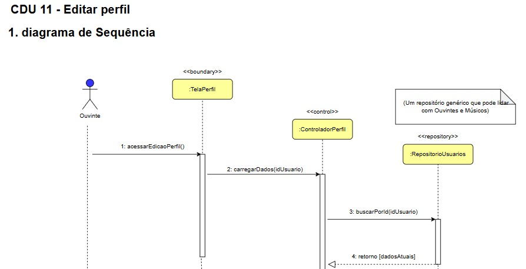
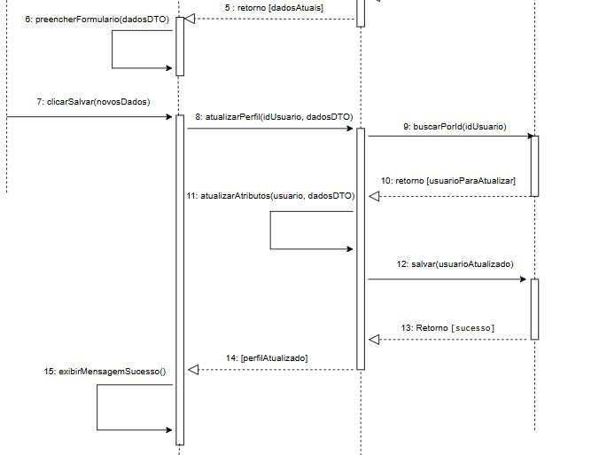
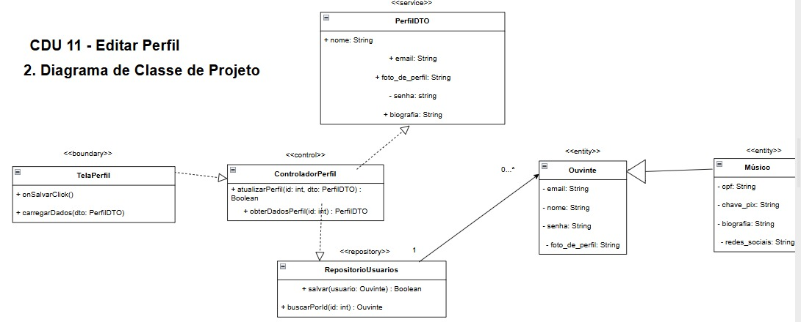

# CDU011. Nome: Editar Perfil

- **Ator principal**: Ouvinte e músico.
- **Atores secundários**: 
- **Resumo**: Permite que o usuário autenticado (ouvinte ou músico) edite as informações do seu perfil, como nome, foto e dados de contato.
- **Pré-condição**: O usuário deve estar autenticado no sistema.
- **Pós-condição**: O perfil é atualizado com as novas informações fornecidas.

## Fluxo Principal – Perfil editado com sucesso
| Ações do ator | Ações do sistema |
| :-----------------: | :-----------------: | 
| 1 - Acessa a opção “Editar Perfil”	| | 
|                                       | 2 - Exibe o formulário com os dados atuais do perfil |
| 3 - Modifica os dados desejados	    | | 
|                                       | 4 - Valida as informações inseridas |
| 5 - Confirma a edição	                | | 
|                                       | 6 - Atualiza os dados e exibe mensagem de sucesso |

## Fluxo Alternativo I – Dados inválidos
| Ações do ator | Ações do sistema |
| :-----------------: | :-----------------: | 
| 3.1 - Insere dados inválidos (ex: e-mail mal formatado)	| | 
|                                                           | 3.2 - Exibe mensagem: “Corrija os campos destacados para continuar”  |

## Fluxo Alternativo II – Falha na atualização
Ações do ator	Ações do sistema
| 5.1 - Confirma edição e ocorre falha de conexão ou erro interno	| | 
|                                                                   | 5.2 - Exibe mensagem: “Erro ao salvar alterações. Tente novamente mais tarde” |

> Obs. as seções a seguir apenas serão utilizadas na segunda unidade do PDSWeb (segundo orientações do gerente do projeto).

## Diagrama de Interação (Sequência ou Comunicação)

<!-- > Substituir pela imagem correspondente... -->

## Diagrama de Classes de Projeto

<!-- > Substituir pela imagem contendo as classes (modelo, visão e templates) que implementam o respectivo CDU... -->
