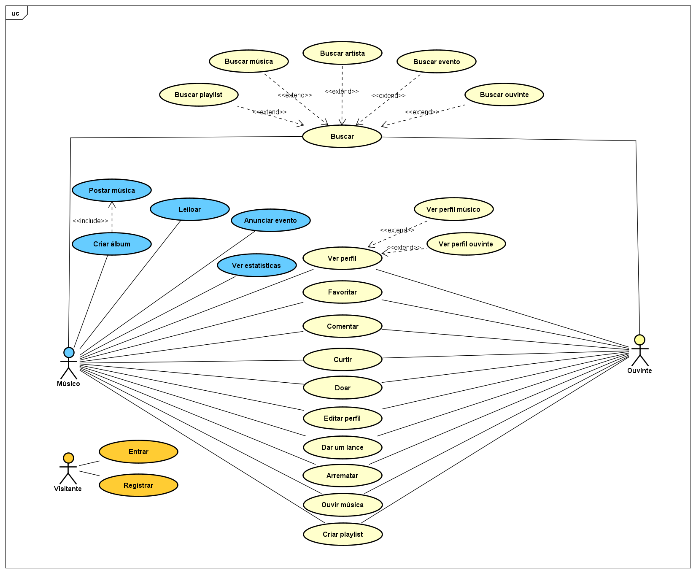

# Modelo de Casos de Uso

## 1. Diagrama de Casos de Uso

## 2. Listagem dos detalhamentos dos casos de uso(em ordem de prioridade)

<!-- MODELO BASE 1. [CDU-001 - Nome...](cdu-001/detalhamento-001.md) -->
1.  [ CDU-001 - Ouvir música        ](cdu-001/detalhamento-001.md)
2.  [ CDU-002 - Criar álbum            ](cdu-002/detalhamento-002.md)
3.  [ CDU-003 - Ver estatísticas    ](cdu-003/detalhamento-003.md)
4.  [ CDU-004 - Criar playlist    ](cdu-004/detalhamento-004.md)
5.  [ CDU-005 - Doar   ](cdu-005/detalhamento-005.md)
6.  [ CDU-006 - Buscar  ](cdu-006/detalhamento-006.md)
7.  [ CDU-007 - Anunciar evento  ](cdu-007/detalhamento-007.md)
8.  [ CDU-008 - Ver perfil ](cdu-008/detalhamento-008.md)
9.  [ CDU-009 - Editar perfil     ](cdu-009/detalhamento-009.md)
10. [ CDU-010 - Leiloar        ](cdu-010/detalhamento-010.md)
11. [ CDU-011 - Dar um lance](cdu-011/detalhamento-011.md)
12. [ CDU-012 - Arrematar  ](cdu-012/detalhamento-012.md)
13. [ CDU-013 - Comentar  ](cdu-013/detalhamento-013.md)
14. [ CDU-014 - Curtir    ](cdu-014/detalhamento-014.md)
15. [ CDU-015 - Entrar       ](cdu-015/detalhamento-015.md)
16. [ CDU-016 - Registrar    ](cdu-016/detalhamento-016.md)

