# Protótipos de Interface com o Usuário

## Mapa do Site

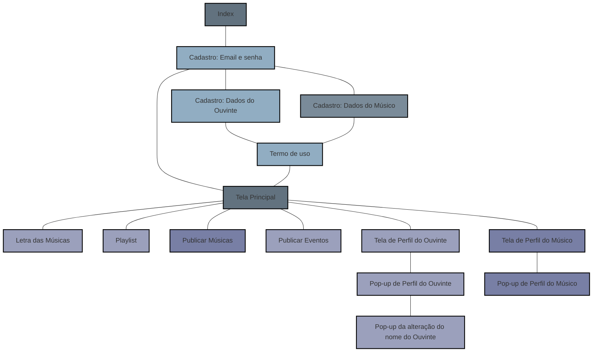
> **Legenda das cores no diagrama acima:**
> - 🟦 Tons de **azul escuro**: Telas principais do sistema (Index, Tela Principal).
> - 🔵 Tons de **azul claro**: Etapas do cadastro do usuário (email, dados, termo).
> - ⚪ Tom de **cinza claro**: Etapa específica para cadastro de **músicos** (exige CPF e chave Pix).
> - 🟪 Tons de **azul arroxeado**: Funcionalidades específicas de músicos (publicar músicas e perfil do músico).
> - 🟣 Tons neutros **cinza claro**: Funcionalidades comuns a todos (playlist, perfil, eventos e letra das músicas).

## Index

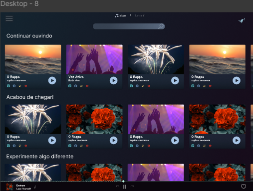

>Tela de abertura do sistema, com opções principais visíveis ao usuário. Serve como ponto de entrada para o fluxo de navegação. Ao interagir com qualquer área da tela, o usuário será redirecionado para a tela de Cadastro, onde poderá validar um perfil existente ou criar um novo. Antes disso, é permitido apenas ouvir uma prévia da música disponível.

[🔗 Link para o Figma (Index)](https://www.figma.com/design/X5e9eTOsq5xgjqFwEmUBO8/Trabalho-completo?node-id=1-254&t=nFIMj9HFZs4MbOlJ-4)

## Tela Principal

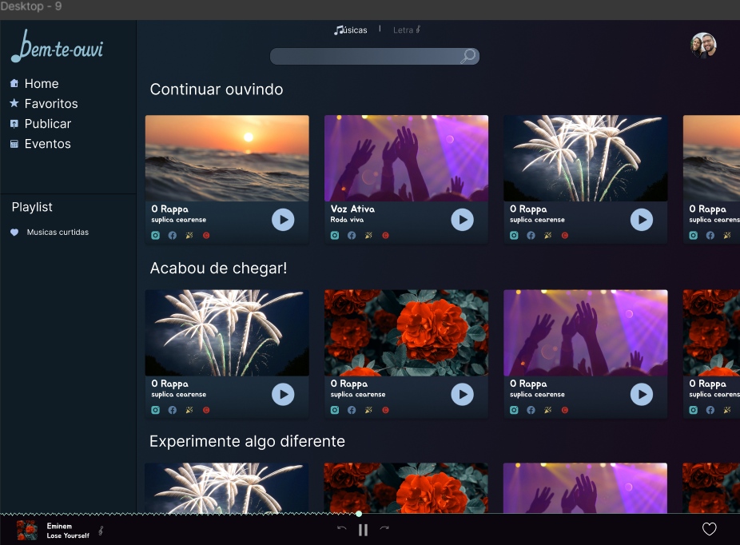

>Tela principal para usuários já cadastrados. Permite acesso ao sistema mediante autenticação com e-mail e senha, permitindo ao usuário ouvir suas músicas, visualizar seu perfil e criar playlists.

[🔗 Link para o Figma (Login)](https://www.figma.com/design/X5e9eTOsq5xgjqFwEmUBO8/Trabalho-completo?node-id=1-410&t=xpfNxyFM5FqJYoz6-11)

## Cadastro: Email e senha

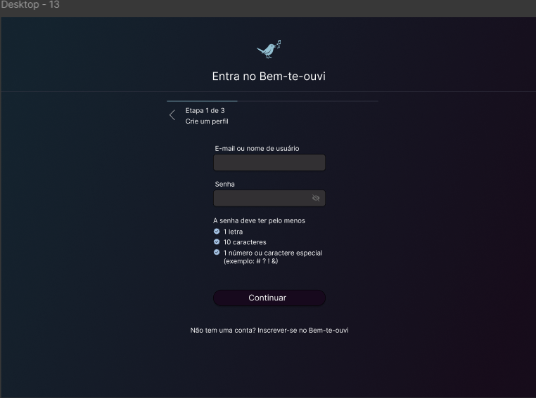

>Primeira etapa do processo de cadastro de usuário. Solicita informações básicas como e-mail e senha.

[🔗 Link para o Figma (Email e senha)](https://www.figma.com/design/X5e9eTOsq5xgjqFwEmUBO8/Trabalho-completo?node-id=1-2100&t=Q8Izkp1q2Kp7JaFA-11)

## Cadastro: Dados do ouvinte

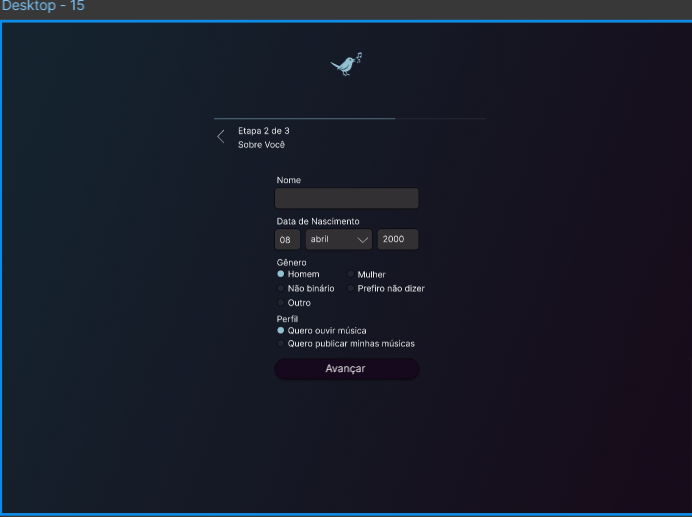

>Segunda etapa do cadastro. Aqui o usuário fornece o nome, data de nascimento, gênero e o tipo de perfil (ouvinte ou músico).

[🔗 Link para o Figma (Dados do ouvinte)](https://www.figma.com/design/X5e9eTOsq5xgjqFwEmUBO8/Trabalho-completo?node-id=2-2467&t=Q8Izkp1q2Kp7JaFA-11)

## Cadastro: Dados do músico

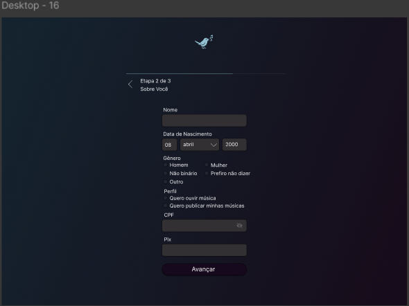

>Versão alternativa da etapa anterior, destinada a músicos. São solicitados dados adicionais como CPF e chave Pix.

[🔗 Link para o Figma (Dados pessoais do músico)](https://www.figma.com/design/X5e9eTOsq5xgjqFwEmUBO8/Trabalho-completo?node-id=2-2521&t=Q8Izkp1q2Kp7JaFA-11)

## Termo de uso

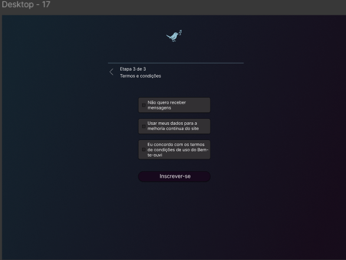

>Etapa final do cadastro, onde o usuário aceita os termos de uso e a receber notificações por email.

[🔗 Link para o Figma (Termo de uso)](https://www.figma.com/design/X5e9eTOsq5xgjqFwEmUBO8/Trabalho-completo?node-id=2-2573&t=Q8Izkp1q2Kp7JaFA-11)

## Letras das músicas

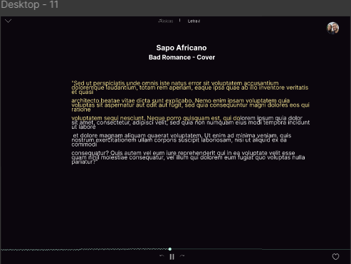

>Tela de visualização da letra da música selecionada.

[🔗 Link para o Figma (Letras das músicas)](https://www.figma.com/design/X5e9eTOsq5xgjqFwEmUBO8/Trabalho-completo?node-id=1-694&t=nFIMj9HFZs4MbOlJ-11)

## Playlist

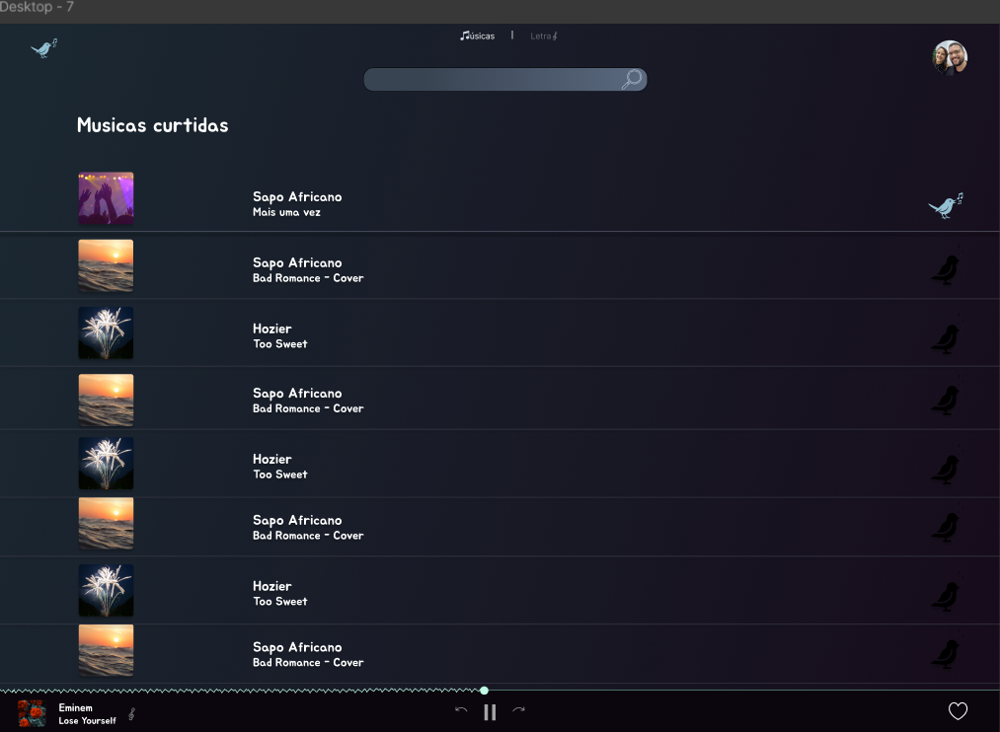

>Tela com a playlist personalizada do usuário, contendo as músicas curtidas.

[🔗 Link para o Figma (Playlist)](https://www.figma.com/design/X5e9eTOsq5xgjqFwEmUBO8/Trabalho-completo?node-id=1-5&t=xpfNxyFM5FqJYoz6-11)

## Publicar Músicas

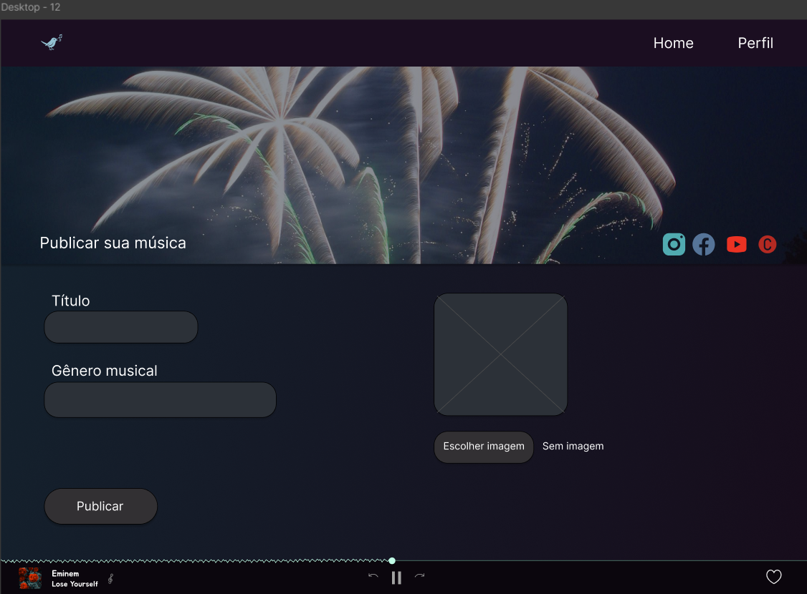

>Página exclusiva para músicos autenticados, permitindo a publicação de novas músicas.

[🔗 Link para o Figma (Publicar músicas)](https://www.figma.com/design/X5e9eTOsq5xgjqFwEmUBO8/Trabalho-completo?node-id=1-1797&t=xpfNxyFM5FqJYoz6-11)

## Publicar Eventos

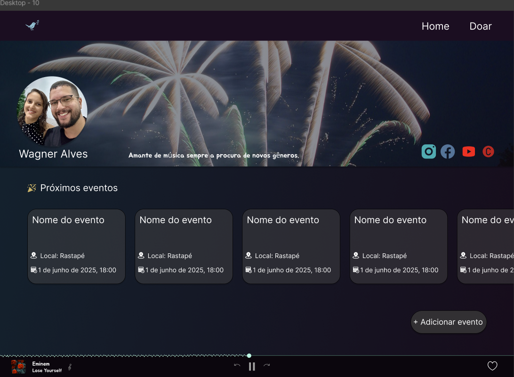

>Página de visualização dos eventos, contendo o botão de publicar APENAS para perfis de músicos.

[🔗 Link para o Figma (Publicar eventos)](https://www.figma.com/design/X5e9eTOsq5xgjqFwEmUBO8/Trabalho-completo?node-id=1-572&t=xpfNxyFM5FqJYoz6-11)

## Tela de Perfil

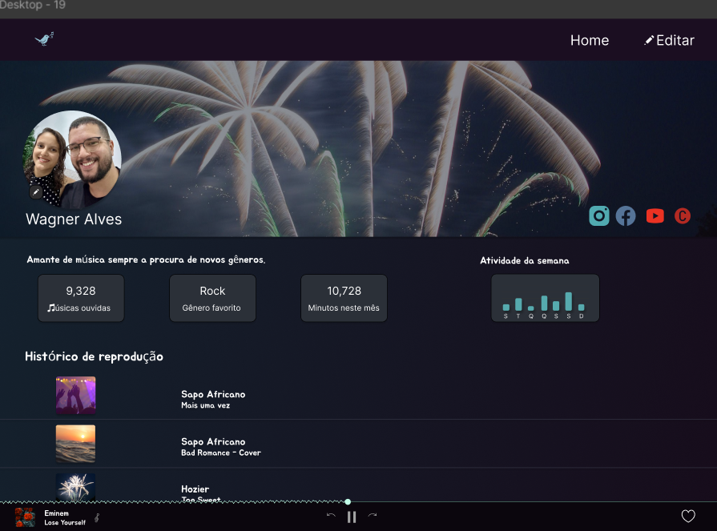

>Tela de perfil do usuário com alguns dados de estatística, com gênero favorito de músicas e histórico de reprodução, podendo editar os dados e imagem do perfil, ao clicar no botão 'Editar', será exibido um pop-up com campos para atualização de dados pessoais.

[🔗 Link para o Figma (Página de Perfil)](https://www.figma.com/design/X5e9eTOsq5xgjqFwEmUBO8/Trabalho-completo?node-id=27-377&t=xpfNxyFM5FqJYoz6-11)

## Pop-up de ouvinte

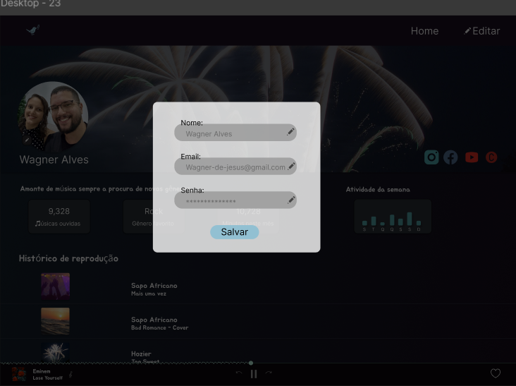

>A tela de pop-up do ouvinte com algumas opções para alterar.

[🔗 Link para o Figma (Pop-up do peril do ouvinte)](https://www.figma.com/design/X5e9eTOsq5xgjqFwEmUBO8/Trabalho-completo?node-id=55-43&t=BTBx9xF9hMUHCRpk-11)

## Pop-up de ouvinte com alteração

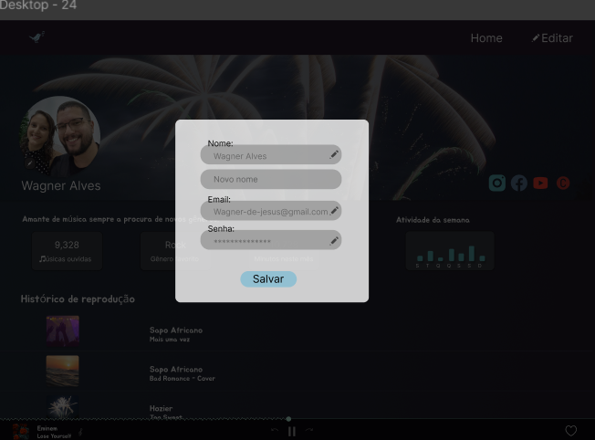

>A tela de pop-up do ouvinte como vai aparecer para botar o novo nome por exemplo.

[🔗 Link para o Figma (Página de Perfil)](https://www.figma.com/design/X5e9eTOsq5xgjqFwEmUBO8/Trabalho-completo?node-id=55-378&t=BTBx9xF9hMUHCRpk-11)

## Tela de Perfil do Músico

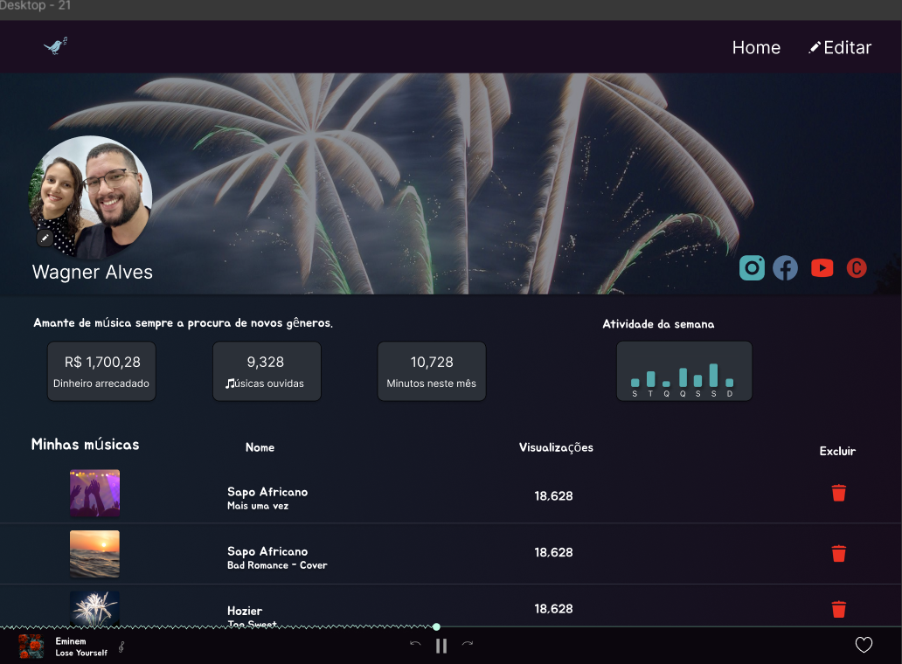

>A tela de perfil do músico apresenta dados importantes, como o montante arrecadado com suas publicações, além de disponibilizar funcionalidades administrativas, como a exclusão de músicas previamente cadastradas.

[🔗 Link para o Figma (Página de Perfil do Músico)](https://www.figma.com/design/X5e9eTOsq5xgjqFwEmUBO8/Trabalho-completo?node-id=27-377&t=xpfNxyFM5FqJYoz6-11)

## Pop-up do perfil do músico

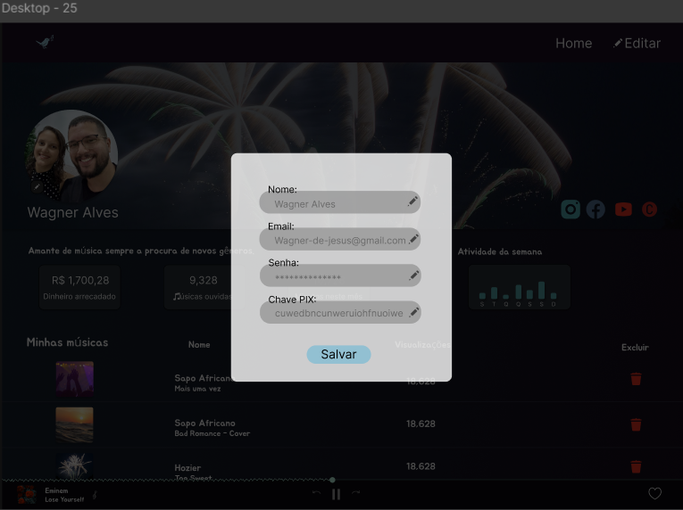

>A tela de pop-up do músico com algumas opções para alterar.

[🔗 Link para o Figma (Página de Pop-up do músico)](https://www.figma.com/design/X5e9eTOsq5xgjqFwEmUBO8/Trabalho-completo?node-id=55-714&t=BTBx9xF9hMUHCRpk-11)

## Referências dos protótipos

- [Protótipo no Figma](https://www.figma.com/design/X5e9eTOsq5xgjqFwEmUBO8/Trabalho-completo?node-id=0-1&t=YMnscRLw9gIv3vjf-1)
- [Fluxo visual no Excalidraw](https://excalidraw.com/#json=gugQcYljLX3EsOD69yx4A,-xPLHLwmdbqaG1C4JKIjiA)
